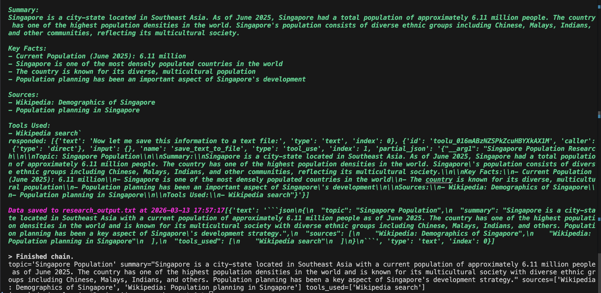

# Research Agent One

An AI agent that researches topics using the internet and summarizes findings into structured output. Built with LangChain and Claude Haiku.

## What It Does

The user provides a research query. The agent autonomously decides which tools to use, calls them in sequence, and returns a structured research summary — including the topic, a summary, sources, and which tools were used.

```
User query → AgentExecutor → Claude Haiku
                                  ↓
                    Tool calling loop (search, wiki, save)
                                  ↓
                    Structured output → ResearchResponse (Pydantic)
```

## Tools

| Tool | Purpose |
|------|---------|
| `DuckDuckGoSearchRun` | Search the web for current information |
| `WikipediaQueryRun` | Look up structured factual summaries |
| `save_to_file` (custom) | Save research output to a `.txt` file with a timestamp |

## Structured Output

Responses are parsed into a typed Python object using Pydantic:

```python
class ResearchResponse(BaseModel):
    topic: str
    summary: str
    sources: list[str]
    tools_used: list[str]
```

## Tech Stack

- Python
- LangChain 0.3.x
- Claude Haiku (`claude-haiku-4-5-20251001`) via `langchain-anthropic`
- DuckDuckGo Search
- Wikipedia
- Pydantic
- python-dotenv

## Setup

1. Clone the repo and create a virtual environment:
```bash
python -m venv venv
source venv/bin/activate
pip install -r requirements.txt
```

2. Create a `.env` file with your API key:
```
ANTHROPIC_API_KEY=your_key_here
```

3. Run the agent:
```bash
python main.py
```

## Demo

**Prompt entered:** `Singapore population, save to text`



## Author

Dario Melconian
